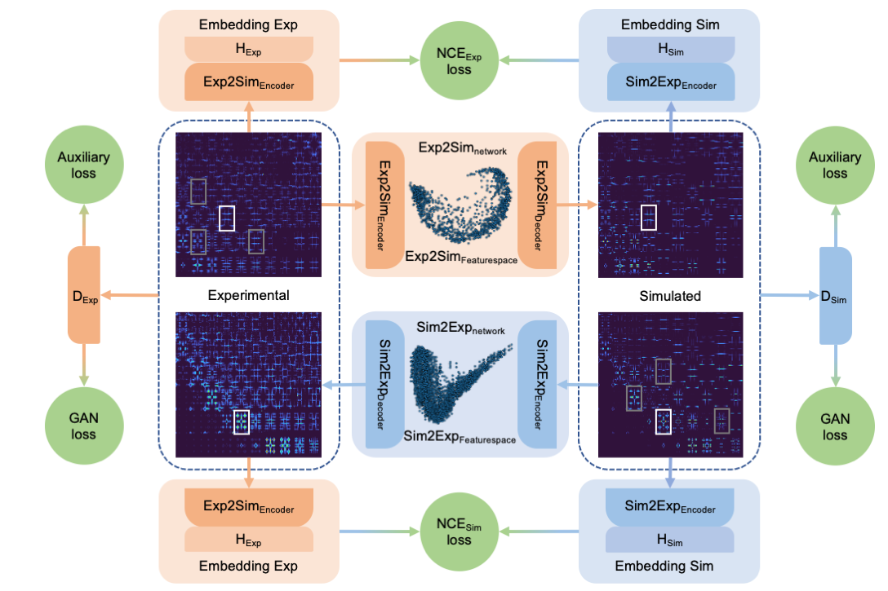

[ChemRxiv] XXX  |  [Paper] XXX

# Exp2SimGAN
Welcome to Exp2SimGAN, a machine learning algorithm that learns to translate between simulated- and experimental data! 

<p align="center">
  
</p>

1. [Exp2SimGAN](#Exp2SimGAN)
2. [Getting started](#getting-started)
    1. [Try Exp2SimGAN on Colab](#try-exp2simgan-on-olab)
    2. [Install requirements](#install-requirements)
    3. [Construct dataset](#construct-dataset)
    4. [Train model](#train-model)
    5. [Predict with model](#predict-with-model)
    6. [Can we trust the Machine?](#Can-we-trust-the-Machine)
    7. [3D data](#3D-data)
3. [Author](#author)
4. [Cite](#cite)
5. [Acknowledgments](#Acknowledgments)
6. [License](#license)  

Exp2SimGAN is a dual contrastive adversarial generative network that is trained on two domains of instances as simulated and experimental data. It learns to translate between the two domains while preserving the features of the conditioning instance. An instance can be a 1D, 2D or 3D dataset. In this paper, we have explored the use of Exp2SimGAN on 2D and 3D inelastic neutron scattering data.
The network is easy to train since it only requires to divide the data into seperate folder - oppositely does the network require large amounts of memory to train. If you do not have access to large amounts of memory, please write andy@chem.ku.dk to get help. After training, only a fourth of the network has to be used meaning that a lot of memory is freed and the network can be run to predict on most computers.

<p align="center">
  
</p>

# Getting started
Follow these step if you want to train Exp2SimGAN and predict with Exp2SimGAN locally on your own computer.

## Try Exp2SimGAN on Colab
Try to use Exp2SimGAN on Colab which does not require anything installed or downloaded to your computer.
Follow the instructions in our [Colab notebook](https://github.com/AndySAnker/Exp2SimGAN/blob/main/Exp2SimGAN.ipynb)
and try to play around. 

## Install requirements
We have deposited a singularity container (pytorch_20.06-py3.sif) at https://zenodo.org/record/7308423#.Y2zgoOzML0o.
The singularity can for example be used to run a command in the following way:
```
singularity exec --nv pytorch_20.06-py3.sif python train.py 
```

## Construct dataset
Go to the [construct data](/construct_dataset) folder to get guidelines to construct the dataset. 

## Train model
To train your own Exp2SimGAN model simply run:

```
python train.py --dataroot XXX --name XXX --display_id 0 --save_epoch_freq 1 --model acdcl --input_nc 1 --output_nc 1
```

A list of possible arguments can be found in the following files:
- [base options](/options/base_options.py)
- [train options](/options/train_options.py)

## Predict with model
To predict using Exp2SimGAN simply run:

```
python test.py  --dataroot XXX --name XXX --epoch XXX --model acdcl --input_nc 1 --output_nc 1
```

A list of possible arguments can be found in the following files:
- [base options](/options/base_options.py)
- [test options](/options/test_options.py)

## Can we trust the Machine?
We have also implemented an quantification for how much you can trust the results of Exp2SimGAN on your data inspired by a [FID score](https://arxiv.org/abs/1706.08500). Here we calculate the Wasserstein distance between the dataset and the trainingset in the featurespace. A small Wasserstein distance represents data with high similarity to the trainingset and the model can confidently be applied on this dataset. However, a large Wasserstein distance represents data with low similarity to the trainingset and the user has to be cautious to use the model on this dataset.

<p align="center">
  
</p>

Go to [INS_similarity](INS_similarity/) to get guidelines of how to achieve quantified values of how much we can trust the trained model on a particular dataset.

## 3D data
Go to the [3DINS](/3DINS) folder to get guidelines to construct and train Exp2SimGAN on a 3D dataset. 

# Authors
__Andy S. Anker__<sup>1</sup>   
__Keith T. Butler__<sup>2,4</sup>  
__Manh Duc Le__<sup>3</sup>  
__Toby G. Perring__<sup>3</sup>     
__Jeyan Thiyagalingam__<sup>2</sup>    
 
<sup>1</sup> Department of Chemistry and Nano-Science Center, University of Copenhagen, Denmark.   
<sup>2</sup> Scientific Computing Department, Rutherford Appleton Laboratory, England.   
<sup>3</sup> ISIS Neutron and Muon Source, Rutherford Appleton Laboratory, England.   
<sup>4</sup> Current affiliation: School of Engineering and Materials Science, Queen Mary University of London, England.   
Should there be any question, desired improvement or bugs please contact us on GitHub or 
through email: __andy@chem.ku.dk__.

# Cite
If you use our code or our results, please consider citing our papers. Thanks in advance!
```
@article{anker2022Exp2SimGAN,
  title={Using generative adversarial networks to match experimental and simulated inelastic neutron scattering data},
  author={Andy S. Anker, Keith T. Butler, Manh D. Le, Toby G. Perring, Jeyan Thiyagalingam},
  year={2022}}
```

# Acknowledgments
Our code is developed based on the the following publication:
```
@inproceedings{han2021dual,
  title={Dual contrastive learning for unsupervised image-to-image translation},
  author={Han, Junlin and Shoeiby, Mehrdad and Petersson, Lars and Armin, Mohammad Ali},
  year={2021}
}
```
```
@inproceedings{park2020cut,
  title={Contrastive Learning for Unpaired Image-to-Image Translation},
  author={Taesung Park and Alexei A. Efros and Richard Zhang and Jun-Yan Zhu},
  year={2020}
}
```

# License
This project is licensed under the Apache License Version 2.0, January 2004 - see the [LICENSE](LICENSE) file for details.
